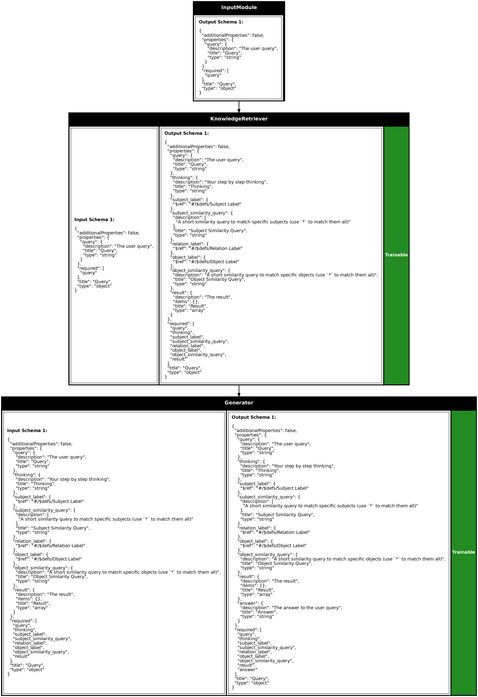

# Knowledge Augmented Generation

Moving beyond simple entity retrieval, Knowledge Augmented Generation (KAG) architectures unlock more sophisticated reasoning capabilities by leveraging the relationships between entities in your knowledge graph.

```python
import synalinks
import asyncio
from typing import Literal
from typing import Union

from knowledge_graph_schema import City, Country, Place, Event
from knowledge_graph_schema import IsCapitalOf, IsLocatedIn, IsCityOf, TookPlaceIn


class Query(synalinks.DataModel):
    query: str = synalinks.Field(
        description="The user query",
    )

class Answer(synalinks.DataModel):
    answer: str = synalinks.Field(
        description="The answer to the user query",
    )

async def main():

    language_model = synalinks.LanguageModel(
        model="ollama/mistral",
    )

    embedding_model = synalinks.EmbeddingModel(
        model="ollama/mxbai-embed-large",
    )

    knowledge_base = synalinks.KnowledgeBase(
        index_name="neo4j://localhost:7687",
        entity_models=[City, Country, Place, Event],
        relation_models=[IsCapitalOf, IsLocatedIn, IsCityOf, TookPlaceIn],
        embedding_model=embedding_model,
        metric="cosine",
        wipe_on_start=False,
    )
    
    inputs = synalinks.Input(data_model=Query)
    query_result = await synalinks.KnowledgeRetriever(
        entity_models=[City, Country, Place, Event],
        relation_models=[IsCapitalOf, IsLocatedIn, IsCityOf, TookPlaceIn],
        knowledge_base=knowledge_base,
        language_model=language_model,
        return_inputs=True,
        return_query=True,
    )(inputs)
    outputs = await synalinks.Generator(
        data_model=Answer,
        language_model=language_model,
        instructions=[
            "Your task is to answer in natural language to the query based on the results of the search",
            "If the result of the search is not relevant, just say that you don't know",
        ],
        return_inputs=True,
    )(query_result)

    program = synalinks.Program(
        inputs=inputs,
        outputs=outputs,
        name="simple_kag",
        description="A simple KAG program",
    )

    synalinks.utils.plot_program(
        program,
        to_folder="examples/knowledge/retrieval",
        show_trainable=True,
        show_schemas=True,
    )
    
    result = await program(Query(query="What is the French capital?"))
    
    print(result.prettify_json())
    

if __name__ == "__main__":
    asyncio.run(main())
```



#### KAG Example Result

```json
{
  "query": "What is the French capital?",
  "thinking": "The question is asking for information about a specific city, which is the capital of France. The subjects involved are 'French' and 'capital'. However, since we are looking for a city, I will focus on the second subject.",
  "subject_label": "City",
  "subject_similarity_query": "*",
  "relation_label": "IsCapitalOf",
  "object_label": "Country",
  "object_similarity_query": "France",
  "result": [
    {
      "subj": {
        "name": "Rome",
        "label": "City"
      },
      "relation": "IsCapitalOf",
      "obj": {
        "name": "Vatican City",
        "label": "Country"
      },
      "score": 0.8975120754014027
    },
    {
      "subj": {
        "name": "Vatican City",
        "label": "City"
      },
      "relation": "IsCapitalOf",
      "obj": {
        "name": "Vatican City",
        "label": "Country"
      },
      "score": 0.8975120754014027
    },
    {
      "subj": {
        "name": "London",
        "label": "City"
      },
      "relation": "IsCapitalOf",
      "obj": {
        "name": "United Kingdom",
        "label": "Country"
      },
      "score": 0.9030690106522803
    },
    {
      "subj": {
        "name": "Belfast",
        "label": "City"
      },
      "relation": "IsCapitalOf",
      "obj": {
        "name": "United Kingdom",
        "label": "Country"
      },
      "score": 0.9030690106522803
    },
    {
      "subj": {
        "name": "Rome",
        "label": "City"
      },
      "relation": "IsCapitalOf",
      "obj": {
        "name": "Italy",
        "label": "Country"
      },
      "score": 0.9245654142023485
    },
    {
      "subj": {
        "name": "Paris",
        "label": "City"
      },
      "relation": "IsCapitalOf",
      "obj": {
        "name": "Germany",
        "label": "Country"
      },
      "score": 0.9306481791338741
    },
    {
      "subj": {
        "name": "Paris",
        "label": "City"
      },
      "relation": "IsCapitalOf",
      "obj": {
        "name": "Europe",
        "label": "Country"
      },
      "score": 0.941624026613126
    },
    {
      "subj": {
        "name": "London",
        "label": "City"
      },
      "relation": "IsCapitalOf",
      "obj": {
        "name": "Europe",
        "label": "Country"
      },
      "score": 0.941624026613126
    },
    {
      "subj": {
        "name": "Rome",
        "label": "City"
      },
      "relation": "IsCapitalOf",
      "obj": {
        "name": "Europe",
        "label": "Country"
      },
      "score": 0.941624026613126
    },
    {
      "subj": {
        "name": "Paris",
        "label": "City"
      },
      "relation": "IsCapitalOf",
      "obj": {
        "name": "France",
        "label": "Country"
      },
      "score": 0.9998149700645786
    }
  ],
  "answer": "The capital of France is Paris."
```

The key difference between the basic RAG and KAG approaches lies in the retriever component. While `EntityRetriever` focuses on finding individual entities, `KnowledgeRetriever` explores the rich web of relationships between entities. This enables more sophisticated reasoning patterns.

When you ask "What is the French capital?", the KAG system doesn't just find entities related to France or capitals. It traverses the IsCapitalOf relationships to understand the specific connection between Paris and France, providing more accurate and contextually rich answers.

The relationship models (IsCapitalOf, IsLocatedIn, IsCityOf, TookPlaceIn) define the types of connections your system can reason about. This structured approach enables complex queries like "What events took place in cities that are capitals of European countries?" by following chains of relationships across your knowledge graph.

The `return_inputs=True` parameter in both retriever and generator components ensures that information flows through your pipeline without loss. This allows downstream components to access both the original query and any intermediate results, enabling more sophisticated processing strategies.
The instruction set for the generator provides crucial guidance for response generation. The instruction to acknowledge when search results aren't relevant prevents hallucination and maintains system reliability. You can customize these instructions based on your specific use case requirements.

Don't forget that these instructions can be optimized to enhance the reasoning capabilities of your KAGs.

## Key Takeaways

- **Dynamic Knowledge Integration**: RAG systems bridge the gap between static training data and real-time information needs by dynamically retrieving and incorporating external knowledge. This enables AI systems to provide current, accurate responses without requiring model retraining.

- **Three-Stage Architecture**: The retrieval-augmentation-generation pipeline creates a clear separation of concerns where each stage can be optimized independently. This modular approach improves maintainability and allows for targeted performance improvements.

- **Entity vs Relationship Retrieval**: EntityRetriever focuses on finding individual knowledge components, while KnowledgeRetriever explores the rich web of relationships between entities. This distinction enables different reasoning patterns depending on query complexity.

- **Schema-Driven Pipeline Design**: Synalinks enforces structured data flow through explicit Query and Answer models, ensuring type safety and predictable behavior across your entire RAG pipeline. This contract-based approach prevents data inconsistencies and enables reliable processing.

- **Graph-Based Knowledge Representation**: Using Neo4j with defined entity and relationship models creates a structured knowledge foundation that supports both simple lookups and complex traversal queries. This approach scales from basic Q&A to sophisticated reasoning tasks.

- **Flexible Component Composition**: The modular architecture allows you to compose retrieval and generation components with precision while maintaining flexibility for different use cases. Components can be swapped, optimized, or extended without affecting the entire pipeline.