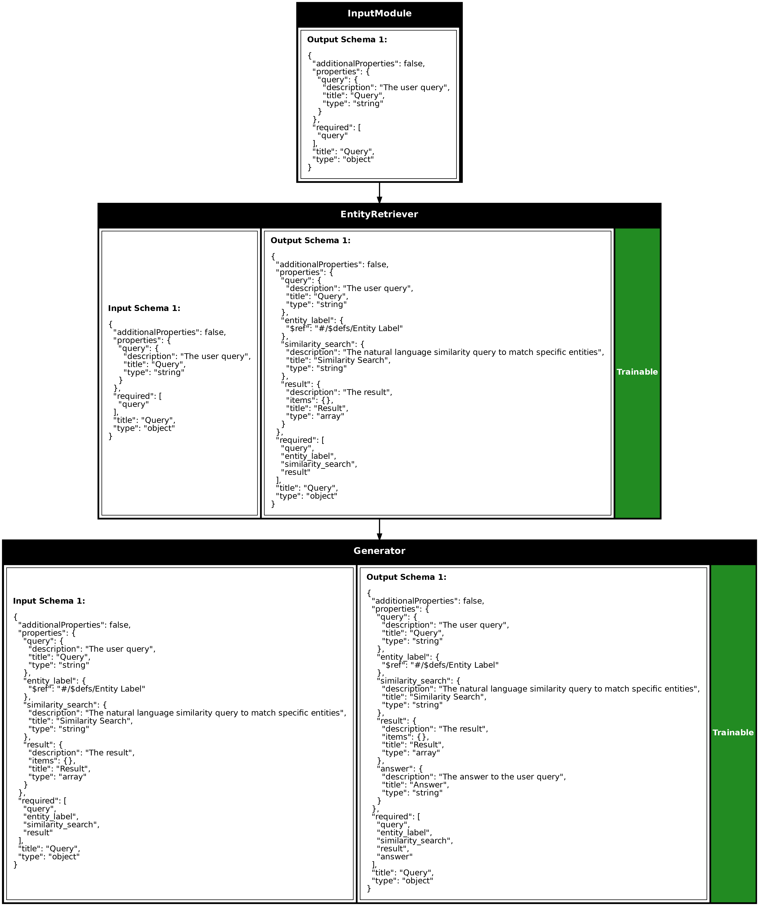

# Retrieval Augmented Generation

Retrieval Augmented Generation (RAG) represents a significant leap forward in AI system design, combining the creative power of language models with precise information retrieval capabilities. This tutorial will guide you through building sophisticated RAG systems using Synalinks, moving from basic document retrieval to advanced Knowledge Augmented Generation (KAG) architectures.

### Understanding the Foundation

RAG systems solve a fundamental limitation of traditional language models: their reliance on static training data. While language models excel at generating coherent text, they cannot access information beyond their training cutoff or incorporate real-time data. RAG bridges this gap by dynamically retrieving relevant information and weaving it into the generation process.

The architecture follows three core stages. The retrieval stage searches through external knowledge bases to find relevant documents or knowledge fragments. The augmentation stage enhances the original query with this retrieved context, providing the language model with additional information to work with. Finally, the generation stage produces responses that synthesize both the user's query and the retrieved knowledge.

Synalinks streamlines this complex process through its modular architecture, allowing you to compose retrieval and generation components with precision while maintaining flexibility for different use cases.

## Understanding RAG Architecture

Synalinks streamlines RAG implementation through its modular architecture, allowing you to compose retrieval and generation components with precision and flexibility.

The foundation of any RAG system begins with defining your data models. These models structure how information flows through your pipeline and ensure consistency across components. You check the tutorial about knowledge graph schemas to have a description of each data model.

```python
import synalinks
import asyncio
from typing import Literal
from typing import Union

from knowledge_graph_schema import City, Country, Place, Event
from knowledge_graph_schema import IsCapitalOf, IsLocatedIn, IsCityOf, TookPlaceIn


class Query(synalinks.DataModel):
    query: str = synalinks.Field(
        description="The user query",
    )

class Answer(synalinks.DataModel):
    answer: str = synalinks.Field(
        description="The answer to the user query",
    )

async def main():

    language_model = synalinks.LanguageModel(
        model="ollama/mistral",
    )

    embedding_model = synalinks.EmbeddingModel(
        model="ollama/mxbai-embed-large",
    )

    knowledge_base = synalinks.KnowledgeBase(
        index_name="neo4j://localhost:7687",
        entity_models=[City, Country, Place, Event],
        relation_models=[IsCapitalOf, IsLocatedIn, IsCityOf, TookPlaceIn],
        embedding_model=embedding_model,
        metric="cosine",
        wipe_on_start=False,
    )
    
    inputs = synalinks.Input(data_model=Query)
    query_result = await synalinks.EntityRetriever(
        entity_models=[City, Country, Place, Event],
        knowledge_base=knowledge_base,
        language_model=language_model,
        return_inputs=True,
        return_query=True,
    )(inputs)
    outputs = await synalinks.Generator(
        data_model=Answer,
        language_model=language_model,
        instructions=[
            "Your task is to answer in natural language to the query based on the results of the search",
            "If the result of the search is not relevant, just say that you don't know",
        ],
        return_inputs=True,
    )(query_result)

    program = synalinks.Program(
        inputs=inputs,
        outputs=outputs,
        name="simple_rag",
        description="A simple RAG program",
    )

    synalinks.utils.plot_program(
        program,
        to_folder="examples/knowledge/retrieval",
        show_trainable=True,
        show_schemas=True,
    )
    
    result = await program(Query(query="What is the French capital?"))
    
    print(result.prettify_json())
    

if __name__ == "__main__":
    asyncio.run(main())
```



#### RAG Example Result

```json
{
  "query": "What is the French capital?",
  "entity_label": "City",
  "similarity_search": "The capital of France",
  "result": [
    {
      "node": {
        "name": "Vatican City",
        "label": "City"
      },
      "score": 0.7579443454742432
    },
    {
      "node": {
        "name": "London",
        "label": "City"
      },
      "score": 0.76287841796875
    },
    {
      "node": {
        "name": "Rome",
        "label": "City"
      },
      "score": 0.7706664800643921
    },
    {
      "node": {
        "name": "Brussels",
        "label": "City"
      },
      "score": 0.7798247337341309
    },
    {
      "node": {
        "name": "Strasbourg",
        "label": "City"
      },
      "score": 0.7949252128601074
    },
    {
      "node": {
        "name": "Paris",
        "label": "City"
      },
      "score": 0.8945909738540649
    }
  ],
  "answer": "The capital of France is Paris."
}
```

The `Query` and `Answer` data models serve as the input and output contracts for your RAG system. The `Query` model captures user questions, while the `Answer` model structures the system's responses. This explicit modeling ensures type safety and makes your pipeline's behavior predictable.

The language model uses Ollama's mistral model. The embedding model, `mxbai-embed-large`, transforms text into numerical vectors that enable semantic similarity calculations during retrieval.

The knowledge base represents the heart of your RAG system. By connecting to a Neo4j graph database, it stores and indexes your knowledge using both entity models (City, Country, Place, Event) and relationship models (IsCapitalOf, IsLocatedIn, IsCityOf, TookPlaceIn). The cosine metric ensures that semantically similar content receives higher relevance scores during retrieval.

The `EntityRetriever` component searches through your knowledge base to find entities that match the user's query. It returns both the retrieved entities and maintains the original input for downstream processing. The `Generator` then combines the retrieved context with the original query to produce natural language answers.

## Key Takeaways

- **Overcoming Static Training Limitations**: RAG solves the fundamental problem that language models cannot access information beyond their training cutoff or incorporate real-time data, enabling systems to provide current and comprehensive responses.

- **Synalinks Modular Implementation**: The framework simplifies RAG development through composable components like EntityRetriever and Generator, allowing you to build sophisticated pipelines with clear data flow and maintainable architecture.

- **Explicit Data Model Contracts**: Using structured Query and Answer models ensures type safety and predictable behavior throughout your pipeline, preventing data inconsistencies and enabling reliable processing across all components.

- **Knowledge Foundation**: The tutorial demonstrates how graph databases excel at storing structured knowledge with entities (City, Country, Place, Event) and relationships (IsCapitalOf, IsLocatedIn, IsCityOf, TookPlaceIn), providing a robust foundation for semantic retrieval.

- **Semantic Similarity Scoring**: The example shows how embedding models like mxbai-embed-large convert text to vectors, enabling cosine similarity calculations that rank retrieved entities by relevance.