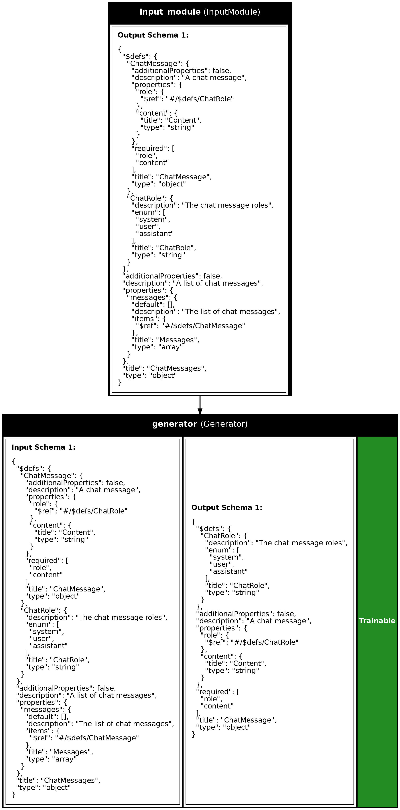

# Conversational Applications

Synalinks is designed to handle conversational applications as well as 
query-based systems. In the case of a conversational applications, the
input data model is a list of chat messages, and the output an individual
chat message. The `Program` is in that case responsible of handling a
**single conversation turn**.

Now we can program our application like you would do with any `Program`. For this example,
we are going to make a very simple chatbot.

By default, if no data_model/schema is provided to the `Generator` it will output a `ChatMessage` like output.
If the data model is `None`, then you can enable streaming.

**Note:** Streaming is disabled during training and should only be used in the **last** `Generator` of your pipeline.

```python
import synalinks
import asyncio

from synalinks.backend import ChatMessage
from synalinks.backend import ChatRole
from synalinks.backend import ChatMessages

language_model = synalinks.LanguageModel(
    model="ollama/mistral",
)

async def main():
    inputs = synalinks.Input(data_model=ChatMessages)
    outputs = await synalinks.Generator(
        language_model=language_model,
        prompt_template=synalinks.chat_prompt_template(),
        streaming=False,  # Marimo chat don't handle streaming yet
    )(inputs)

    program = synalinks.Program(
        inputs=inputs,
        outputs=outputs,
        name="simple_chatbot",
        description="A simple conversation application",
    )

    # Plot this program to understand it
    synalinks.utils.plot_program(
        program,
        show_module_names=True,
        show_trainable=True,
        show_schemas=True,
    )

if __name__ == "__main__":
    asyncio.run(main())
```



## Conclusion

In this notebook, we explored how Synalinks handle conversational applications.
You have now a solid understanding to create chatbots and conversational agents.

### Key Takeaways

- **Conversational Flow Management**: Synalinks effectively manages conversational 
    applications by handling inputs as a list of chat messages and generating
    individual chat messages as outputs. This structure allows for efficient 
    processing of conversation turns.

- **Streaming and Real-Time Interaction**: Synalinks supports streaming for 
    real-time interactions, enhancing user engagement. However, streaming is 
    disabled during training and should be used only in the final `Generator`.

- **Customizable Prompt Templates**: The prompt templates can be tailored to fit
    conversational contexts, guiding the language model to produce coherent and 
    relevant responses.