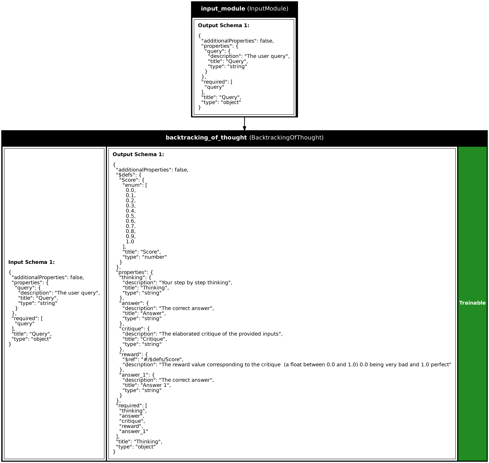

# Implementing Custom Modules Via Subclassing

This tutorial, is for more advanced users, it will cover how to 
create custom modules/programs via subclassing.

In this tutorial, we will cover the following themes:

- The `Module` class
- The `add_variable()` method
- Trainable and non-trainable variables
- The `compute_output_spec()` and `build()` method
- The training argument in `call()`
- Making sure your module/program can be serialized

---

One of the main abstraction of Synalinks is the `Module` class.
A `Module` encapsulate both a state (the module's variables) and 
a transformation from inputs to outputs (the `call()` method).

For this tutorial, we are going to make a simple neuro-symbolic component
called `BacktrackingOfThought`. This component is an adaptation of the 
famous backtracking algorithm, used a lot in symbolic planning/reasoning, 
combined with chain of thought, nowadays most used technique to enhance
the LMs predicitons. 

The principle is straitforward, the component will have to "think" then 
we will critique at runtime the thinking and aggregate it to 
the current chain of thinking only if it is above the given threshold. 
This mechanism will allow the system to discard bad thinking to resume 
at the previsous step. Additionally we will add a stop condition.

This algorithm a simplified version of the popular `TreeOfThought` that
instead of being a tree strucutre, is only a sequential chain of thinking.

```python
import synalinks
import asyncio

class Query(synalinks.DataModel):
    query: str = synalinks.Field(
        description="The user query",
    )
    
class Answer(synalinks.DataModel):
    answer: str = synalinks.Field(
        description="The correct answer",
    )

language_model = synalinks.LanguageModel(
    model="ollama/mistral",
)

class BacktrackingOfThought(synalinks.Module):
    def __init__(
        self,
        schema=None,
        data_model=None,
        language_model=None,
        backtracking_threshold=0.5,
        stop_threshold=0.9,
        max_iterations=5,
        return_inputs=False,
        prompt_template=None,
        examples=None,
        instructions=None,
        use_inputs_schema=False,
        use_outputs_schema=False,
        name=None,
        description=None,
        trainable=True,
    ):
        super().__init__(
            name=name,
            description=description,
            trainable=trainable,
        )
        if not schema and data_model:
            schema = data_model.get_schema()
        self.schema = schema
        self.language_model = language_model
        self.backtracking_threshold = backtracking_threshold
        self.stop_threshold = stop_threshold
        self.max_iterations = max_iterations
        self.return_inputs = return_inputs
        self.prompt_template = prompt_template
        self.examples = examples
        self.instructions = instructions
        self.use_inputs_schema = use_inputs_schema
        self.use_outputs_schema = use_outputs_schema
        
        self.thinking = []
        for i in range(self.max_iterations):
            self.thinking.append(
                synalinks.ChainOfThought(
                    schema=self.schema,
                    language_model=self.language_model,
                    prompt_template=self.prompt_template,
                    examples=self.examples,
                    return_inputs=False,
                    instructions=self.instructions,
                    use_inputs_schema=self.use_inputs_schema,
                    use_outputs_schema=self.use_outputs_schema,
                    name=self.name + f"_thinking_generator_{i}",
                )
            )
        self.critique = []
        for i in range(self.max_iterations):
            self.critique.append(
                synalinks.SelfCritique(
                language_model=self.language_model,
                prompt_template=self.prompt_template,
                examples=self.examples,
                return_inputs=True,
                instructions=self.instructions,
                use_inputs_schema=self.use_inputs_schema,
                use_outputs_schema=self.use_outputs_schema,
                name=self.name + f"_critique_generator_{i}",
            )
        )
        # This is going to be the final generator
        self.generator = synalinks.Generator(
            schema=self.schema,
            language_model=self.language_model,
            prompt_template=self.prompt_template,
            examples=self.examples,
            return_inputs=self.return_inputs,
            instructions=self.instructions,
            use_inputs_schema=self.use_inputs_schema,
            use_outputs_schema=self.use_outputs_schema,
            name=self.name + "_generator",
        )

    async def call(self, inputs, training=False):
        if not inputs:
            # This is to allow logical flows
            # (e.g. don't run the module if no inputs provided)
            return None
        for i in range(self.max_iterations):
            thinking = await self.thinking[i](
                inputs,
                training=training,
            )
            critique = await self.critique[i](
                thinking,
                training=training,
            )
            reward = critique.get("reward")
            if reward > self.backtracking_threshold:
                inputs = await synalinks.ops.concat(
                    inputs,
                    critique,
                    name=self.name + f"_inputs_with_thinking_{i}",
                )
                if reward > self.stop_threshold:
                    break
        return await self.generator(
            inputs,
            training=training,
        )

    async def compute_output_spec(self, inputs, training=False):
        for i in range(self.max_iterations):
            inputs = await self.thinking[i](inputs)
            inputs = await self.critique[i](inputs)
        return await self.generator(inputs)

    def get_config(self):
        config = {
            "schema": self.schema,
            "backtracking_threshold": self.backtracking_threshold,
            "stop_threshold": self.stop_threshold,
            "max_iterations": self.max_iterations,
            "return_inputs": self.return_inputs,
            "prompt_template": self.prompt_template,
            "examples": self.examples,
            "instructions": self.instructions,
            "use_inputs_schema": self.use_inputs_schema,
            "use_outputs_schema": self.use_outputs_schema,
            "name": self.name,
            "description": self.description,
            "trainable": self.trainable,
        }
        language_model_config = {
            "language_model": synalinks.saving.serialize_synalinks_object(
                self.language_model,
            )
        }
        return {**language_model_config, **config}

    @classmethod
    def from_config(cls, config):
        language_model = synalinks.saving.deserialize_synalinks_object(
            config.pop("language_model")
        )
        return cls(
            language_model=language_model,
            **config,
        )
        
async def main():
    
    inputs = synalinks.Input(data_model=Query)
    outputs = await BacktrackingOfThought(
        language_model=language_model,
        data_model=Answer,
        return_inputs=True,
    )(inputs)
    
    program = synalinks.Program(
        inputs=inputs,
        outputs=outputs,
        name="backtracking_of_thought",
        description="A Backtracking of Thought algorithm",
    )
    
    synalinks.utils.plot_program(
        program,
        to_folder="examples/implementing_custom_modules_and_programs_via_subclassing",
        show_module_names=True,
        show_trainable=True,
        show_schemas=True,
    )
    
    result = await program(
        Query(query=(
              "How can we develop a scalable, fault-tolerant, and secure quantum"
              " computing system that can solve problems intractable for classical"
              " computers, and what are the practical implications for cryptography"
              " and data security?"
            )
        )
    )
    
    print(result.prettify_json())
    
if __name__ == "__main__":
    asyncio.run(main())
```



### Result

```json
{
  "query": "How can we develop a scalable, fault-tolerant, and secure quantum computing system that can solve problems intractable for classical computers, and what are the practical implications for cryptography and data security?",
  "thinking": "Thinking...",
  "answer": "Developing a scalable, fault-tolerant, and secure quantum computing system is a significant challenge due to the unique properties of quantum mechanics. Here's a simplified approach: First, you would need to establish a robust quantum hardware platform such as qubits (quantum bits) made of superconducting circuits or trapped ions. Next, develop error-correcting codes to mitigate errors that naturally occur in quantum systems. Additionally, implement quantum algorithms suitable for the problem at hand, such as Shor's algorithm for factoring large numbers, which is resistant to classical computers but can be solved quickly on a quantum computer. The practical implications for cryptography and data security are profound. Quantum computing could potentially break many of today's encryption methods based on number factorization (e.g., RSA). Therefore, it's essential to develop post-quantum cryptographic algorithms that are resilient against attacks from both classical and quantum computers.",
  "critique": "Your response is detailed, informative, and well-structured. It explains the challenges involved in developing a quantum computing system, provides a simplified approach to solving these challenges, and highlights the potential implications for cryptography and data security. The use of examples such as Shor's algorithm and RSA encryption method adds credibility to your response. However, it might be helpful to break down the process into smaller steps or bullet points for easier comprehension.",
  "reward": 1.0,
  "answer_1": "Developing a scalable, fault-tolerant, and secure quantum computing system is indeed a complex task due to the intricacies of quantum mechanics. Here's a simplified roadmap: \n1. Establishing a robust quantum hardware platform using qubits made from superconducting circuits or trapped ions.\n2. Developing error-correcting codes to combat errors inherent in quantum systems.\n3. Implementing suitable quantum algorithms, like Shor's algorithm for factoring large numbers, which are resistant to classical computers but can be solved quickly on a quantum computer.\nRegarding cryptography and data security, the implications are substantial. Quantum computing could potentially breach many existing encryption methods based on number factorization (such as RSA). Consequently, it's crucial to develop post-quantum cryptographic algorithms that can withstand attacks from both classical and quantum computers."
}
```

### The `__init__()` function

First, let's explain the `__init__()` function. When implementing modules that
use a `Generator`, you want to externalize the generator's parameters 
(`prompt_template`, `instructions`, `examples`, `use_inputs_schema`, `use_outputs_schema`)
to give maximum flexibility to your module when possible.
Then, you have to include the default arguments of a module (`name`, `description`, `trainable`)
that will be provided to the `super().__init__()`. 
Although the name and description are inferred automatically it is a good practice to
let the user personalize them. The `trainable` argument, will indicate if the module 
is frozen or not, meaning that their variables could be updated by the optimizer, 
by default, a module should be trainable. 

And finally, you can add any relevant information, weither for the initialization of 
the variables, or a config parameter like here.

To add a variable to the module, you have to use the `add_variables` function,
this function can only be used in the `__init__()` or in the `build()` function.
The build function is useful to create variables, or initialize your module/program 
based on the actual inputs, that is not known at this stage, remember the module can
accept any inputs.

### How to know when using a `Variable`?

As a rule of thumb, the variables should be anything that evolve over time during
inference/training. These variables could be updated by the module itself, or by 
the optimizer if you have an optimizer designed for that. They will be serialized
when you save your program so you can recover the state of your program by loading
a JSON file. In this example, the variables are encapsulated in the `Generator` module.

### The `call()` function

The `call()` function is the core of the `Module` class. It defines the computation 
performed at every call of the module.
This function takes `inputs` and an optional `training` argument, which indicates
whether the module is in training mode or not.

In the `BacktrackingOfThought` module, the `call()` function implements the 
backtracking logic:

- It iterates up to `max_iterations` times.
- In each iteration, it generates a "thinking" step using the `thinking` generator.
- It then critiques the generated thinking using either a provided critique program or 
    a reward value embedded in the thinking step.
- If the reward exceeds the `backtracking_threshold`, the thinking step is concatenated 
    with the inputs for the next iteration.
- If the reward exceeds the `stop_threshold`, the iteration stops early.
- Finally, the `generator` produces the final output based on the accumulated inputs.

### The `compute_output_spec()` function

The `compute_output_spec()` function is responsible for defining the output data model
of the module/program. It allows the system to understand the structure of the data
produced by this module. Its inputs is always a `SymbolicDataModel`, a placeholder that only contains a JSON schema that serve as data specification.

In this example, `compute_output_spec()` returns a `SymbolicDataModel` based on the module's 
schema by calling the modules sequentially, indicating the expected structure of the output data.

As a rule of thumb, if you access a data model field in your call (using `get()`) you will have to 
implement it otherwise, Synalinks will infer the output spec by running the call 
function with symbolic data models. If you have any doubt, do not implement it and the system will
raise an error if you needs to.

### Serialization and Deserialization

To ensure that your module can be saved and loaded correctly, you need to implement serialization
and deserialization methods. This is crucial for saving the state of your module, including 
any trainable variables, and restoring it later.

- The `get_config()` method should return a dictionary containing all the information needed 
    to recreate the module. This includes the module's configuration and any serialized 
    sub-components like the language model in this case.
- The `from_config()` class method should be able to reconstruct the module from the 
    configuration dictionary returned by `get_config()`.

## Conclusion

By following these guidelines, you can create custom modules in Synalinks that are flexible, 
reusable, and can be integrated into larger programs. The `BacktrackingOfThought` module 
demonstrates how to combine symbolic reasoning with language model predictions to enhance 
the decision-making process.

### Key Takeaways

- **Module Class**: The `Module` class in Synalinks encapsulates both state (variables) 
    and transformation logic (`call()` method), serving as a foundational abstraction for 
    building custom components.
- **Initialization and Variables**: The __init__() function initializes the module, 
    externalizing generator parameters for flexibility. Trainable and non-trainable 
    variables are managed using the add_variables function, ensuring that the 
    module's state can evolve over time and be serialized.
- **Call Function**: The `call()` function defines the core computation of the module,
    handling inputs and producing outputs. In `BacktrackingOfThought`, it implements 
    backtracking logic, iteratively generating and critiquing thinking steps to refine
    the output.
- **Output Specification**: The `compute_output_spec()` function defines the output data
    model, allowing the system to understand the structure of the produced data.
    Implementing this function is crucial when accessing data model fields directly.
- **Serialization**: Proper serialization and deserialization methods (`get_config()` 
    and `from_config()`) ensure that the module's state can be saved and restored, 
    facilitating reuse and integration into larger programs.
- **Flexibility and Reusability**:  By following these guidelines, you can create 
    custom modules that are flexible, reusable, and easily integrated into neuro-symbolic 
    programs. The `BacktrackingOfThought` module exemplifies how to combine symbolic 
    reasoning with language models to improve decision-making processes.