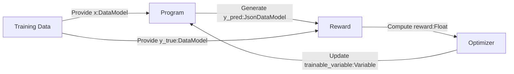

# Rewards, Metrics & Optimizers

## Understanding Rewards

`Reward`s are an essential part of reinforcement learning frameworks. 
They are typically float values (usually between 0.0 and 1.0, but they can be 
negative also) that guide the process into making more efficient decisions or 
predictions. During training, the goal is to maximize the reward function. 
The reward gives the system an indication of how well it performed for that task.



This reinforcement loop is what makes possible for the system to learn by
repeatedly making predictions and refining its knowledge/methodology in order 
to maximize the reward.

All rewards consist of a function or program that takes two inputs:

- `y_pred`: The prediction of the program.
- `y_true`: The ground truth/target value provided by the training data.

In Synalinks, we provide for several built-in rewards but it is also possible to
easily create new rewards if you needs to. Overall the choice will depend on the
task to perform. You can have a look at the rewards provided in the 
[API section](https://synalinks.github.io/synalinks/Synalinks%20API/Rewards/).

### Understanding Metrics

`Metric`s are scalar values that are monitored during training and evaluation.
These values are used to know which program is best, in order to save it. Or to 
provide additional information to compare different architectures with each others.
Unlike `Reward`s, a `Metric` is not used during training, meaning the metric value 
is not backpropagated. Additionaly every reward function can be used as metric. 
You can have a look at the metrics provided in the 
[API section](https://synalinks.github.io/synalinks/Synalinks%20API/Metrics/).

### Predictions Filtering

Sometimes, your program have to output a complex JSON but you want to evaluate
just part of it. This could be because your training data only include a subset
of the JSON, or because the additonal fields were added only to help the LMs.
In that case, you have to filter out or filter in your predictions and ground
truth. Meaning that you want to remove or keep respectively only specific fields
of your JSON data. This can be achieved by adding a `out_mask` or `in_mask` list
parameter containing the keys to remove or keep for evaluation. This parameters
can be added to both reward and metrics. Like in the above example where we only
keep the field `answer` to compute the rewards and metrics.

### Understanding Optimizers

Optimizers are systems that handle the update of the module's state in order to
make them more performant. They are in charge of backpropagating the rewards 
from the training process and select or generate examples and instructions for the LMs.

Here is an example of program compilation, which is how you configure the reward,
metrics, and optimizer:

```python
import synalinks
import asyncio

class Query(synalinks.DataModel):
    query: str = synalinks.Field(
        description="The user query",
    )

class AnswerWithThinking(synalinks.DataModel):
    thinking: str = synalinks.Field(
        description="Your step by step thinking",
    )
    answer: str = synalinks.Field(
        description="The correct answer",
    )

language_model = synalinks.LanguageModel(
    model="ollama/mistral",
)

async def main():
    inputs = synalinks.Input(data_model=Query)
    outputs = await synalinks.Generator(
        data_model=AnswerWithThinking,
        language_model=language_model,
    )(inputs)

    program = synalinks.Program(
        inputs=inputs,
        outputs=outputs,
        name="chain_of_thought",
        description="Useful to answer in a step by step manner.",
    )

    program.compile(
        reward=synalinks.rewards.CosineSimilarity(
            embedding_model=embedding_model,
            in_mask=["answer"],
        ),
        optimizer=synalinks.optimizers.RandomFewShot(),
        metrics=[
            synalinks.metrics.F1Score(in_mask=["answer"]),
        ],
    )
```

## Conclusion
        
In this tutorial, we explored the fundamental concepts of training and 
optimizing Synalinks programs using rewards, metrics, and optimizers. 
These components are crucial for building efficient and adaptive language 
model applications.

### Key Takeaways

- **Rewards**: `Reward`s guide the reinforcement learning process by 
    providing feedback on the system's performance. They are typically
    float values that indicate how well the system performed a task, 
    with the goal of maximizing the reward function during training. 
    Synalinks offers built-in rewards and allows for custom reward 
    functions to suit specific tasks.
    
- **Metrics**: `Metric`s are scalar values monitored during training
    and evaluation to determine the best-performing program. Unlike
    rewards, metrics are not used for backpropagation. They provide 
    additional insights for comparing different architectures and 
    saving the optimal model.
    
- **Optimizers**: `Optimizer`s update the module's state to improve
    performance. They handle the backpropagation of rewards and 
    select or generate examples and instructions for the language models.
    Proper configuration of optimizers is essential for effective
    training.
    
- **Filtering Outputs**: When dealing with complex JSON outputs, 
    filtering predictions and ground truths using `out_mask` or 
    `in_mask` parameters ensures that only relevant fields are 
    evaluated. This is particularly useful when the training data 
    includes a subset of the JSON or when additional fields are
    used to aid the language models.