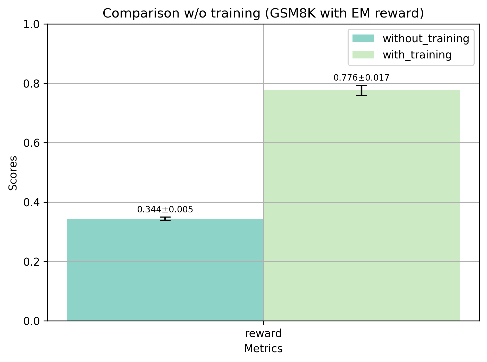

# Training Programs

Like in machine learning, a LM application needs to be trained. In that case, we
don't update the weights of the model, but optimize the prompts by automatically
picking the best examples or generate instructions in order to help the program to 
perform better on your dataset.

For this lesson we are going to work on GSM8k a well known dataset of grade school
math word problems. Nowedays, most (all?) public datasets have been leaked, meaning
that their test set have been included in the LM trainset. This basically means
that the baseline score won't give you much information about the reasoning abilities
of the underlying language model (but more about its capability to remember),
however it is still interesing to have it as a baseline to evaluate the progress 
of the programs training and the neuro-symbolic methods used or if you use small
models like here.

First, let's have a look at the dataset.

### Input Data Model

::: synalinks.src.datasets.gsm8k.MathQuestion

### Output Data Model

::: synalinks.src.datasets.gsm8k.NumericalAnswerWithThinking

Now we can dive into the code used for this benchmark. In this example, we are going to use a small distilled model that can run locally. Training an LM application involves numerous calls to LMs, and it is better to experiment with small models. We are also proving that, despite what most people think, small models, when trained, can compete with their larger counterparts. This makes Synalinks a framework of choice if you want to reduce the costs of your LM applications.

In production settings, this means that you can use smaller and more cost-effective models from your preferred provider while enhancing their accuracy with Synalinks. This is also a good way to fight model obsolescence, as many proprietary providers degrade the performance of their models over time to make people switch to newer/more costly models.

### Benchmark Code

```python
import asyncio
import os

import synalinks

NB_EPOCHS = 2
BATCH_SIZE = 32
NB_SAMPLES = None
NB_RUNS = 3

FOLDER = "examples/training_programs"

checkpoint_filepath = "checkpoint.program.json"

async def main():
    language_model = synalinks.LanguageModel(
        model="ollama/deepseek-r1",
    )
    print("Loading GSM8k dataset...")
    (x_train, y_train), (x_test, y_test) = synalinks.datasets.gsm8k.load_data()
    
    if NB_SAMPLES:
        x_train = x_train[:NB_SAMPLES]
        y_train = y_train[:NB_SAMPLES]
        x_test = x_test[:NB_SAMPLES]
        y_test = y_test[:NB_SAMPLES]
    
    print("Done.")

    print("Creating program...")
    inputs = synalinks.Input(
        data_model=synalinks.datasets.gsm8k.get_input_data_model(),
    )
    outputs = await synalinks.Generator(
        data_model=synalinks.datasets.gsm8k.get_output_data_model(),
        language_model=language_model,
    )(inputs)
    program = synalinks.Program(
        inputs=inputs,
        outputs=outputs,
        name="gsm8k_baseline",
        description="The GSM8k baseline",
    )

    synalinks.utils.plot_program(
        program,
        to_folder=FOLDER,
        show_module_names=True,
        show_schemas=True,
        show_trainable=True,
    )
    
    print("Compiling...")
    program.compile(
        reward=synalinks.rewards.ExactMatch(in_mask=["answer"]),
        optimizer=synalinks.optimizers.RandomFewShot(),
    )
    print("Done.")
    
    print(f"Perform baseline evaluation samples with {NB_RUNS} runs...")
    baseline_metric_list = []
    for i in range(NB_RUNS):
        print(f"Run {i + 1}/{NB_RUNS}")
        metrics = await program.evaluate(
            x=x_test,
            y=y_test,
            batch_size=BATCH_SIZE,
        )
        baseline_metric_list.append(metrics)
    print("Done.")

    synalinks.utils.plot_metrics_with_mean_and_std(
        baseline_metric_list,
        to_folder=FOLDER,
        title="Evaluation without training",
    )

    program.compile(
        reward=synalinks.rewards.ExactMatch(in_mask=["answer"]),
        optimizer=synalinks.optimizers.RandomFewShot(),
    )

    program_checkpoint_callback = synalinks.callbacks.ProgramCheckpoint(
        filepath=os.path.join(FOLDER, checkpoint_filepath),
        monitor="val_reward",
        mode="max",
        save_best_only=True,
    )

    print(f"Start training for {NB_EPOCHS} epochs...")
    history = await program.fit(
        x=x_train,
        y=y_train,
        validation_data=(x_test, y_test),
        epochs=NB_EPOCHS,
        batch_size=BATCH_SIZE,
        callbacks=[program_checkpoint_callback],
    )
    print("Done.")
    
    synalinks.utils.plot_history(
        history,
        to_folder=FOLDER,
        to_file="gsm8k_baseline_training_history.png",
    )
    
    print("Load best performing checkpoint...")
    program.load(os.path.join(FOLDER, checkpoint_filepath))
    print("Done.")
    
    print(f"Perform final evaluation...")
    trained_metric_list = []
    for i in range(NB_RUNS):
        print(f"Run {i + 1}/{NB_RUNS}")
        metrics = await program.evaluate(
            x=x_test,
            y=y_test,
            batch_size=BATCH_SIZE,
        )
        trained_metric_list.append(metrics)
    print("Done.")
    
    metrics_comparison = {
        "without_training": baseline_metric_list,
        "with_training": trained_metric_list,
    }

    synalinks.utils.plot_metrics_comparison_with_mean_and_std(
        metrics_comparison,
        to_folder=FOLDER,
        to_file="gsm8k_evaluation_comparison.png",
        title="Comparison w/o training (GSM8K with EM reward)",
    )

if __name__ == "__main__":
    asyncio.run(main())
```

### The Program Architecture


### Training Result



Here we have a **77.142% increase of performance**, not bad for a small distilled model. You can push the results even higher by training for more epochs or by using multiple optimizers one after another. Another way to have better results is to modify the architecture, using agents with a calculator or a more complex workflow.

## Conclusion
        
In this tutorial, we explored the process of training Synalinks programs
to optimize their performance on specific datasets. By leveraging the GSM8k
dataset of grade school math word problems, we demonstrated how to train a
language model application to improve its reasoning abilities and accuracy.

### Key Takeaways

- **Rewards**: `Reward`s guide the reinforcement learning process by 
    providing feedback on the system's performance. They are typically
    float values that indicate how well the system performed a task, 
    with the goal of maximizing the reward function during training. 
    Synalinks offers built-in rewards and allows for custom reward 
    functions to suit specific tasks.
    
- **Metrics**: `Metric`s are scalar values monitored during training
    and evaluation to determine the best-performing program. Unlike
    rewards, metrics are not used for backpropagation. They provide 
    additional insights for comparing different architectures and 
    saving the optimal model.
    
- **Optimizers**: `Optimizer`s update the module's state to improve
    performance. They handle the backpropagation of rewards and 
    select or generate examples and instructions for the language models.
    Proper configuration of optimizers is essential for effective
    training.
    
- **Filtering Outputs**: When dealing with complex JSON outputs, 
    filtering predictions and ground truths using `out_mask` or 
    `in_mask` parameters ensures that only relevant fields are 
    evaluated. This is particularly useful when the training data 
    includes a subset of the JSON or when additional fields are
    used to aid the language models.