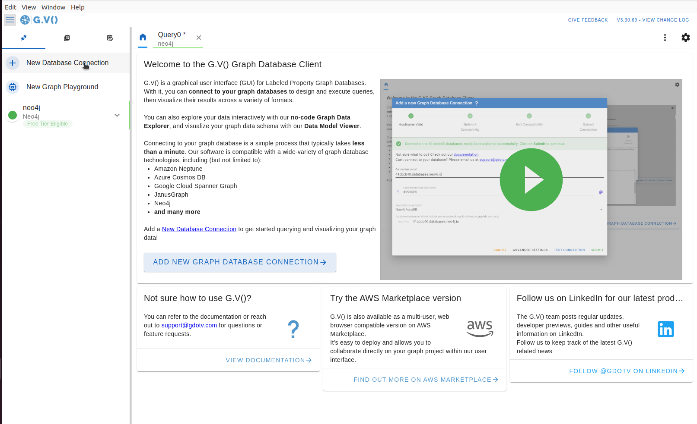
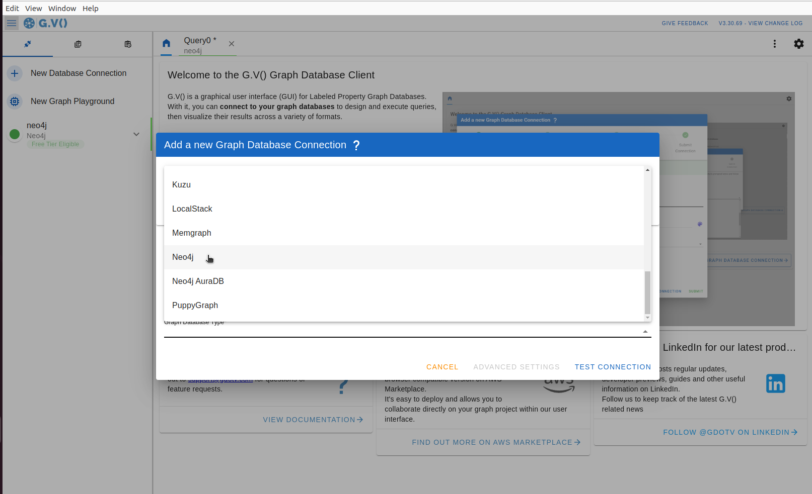
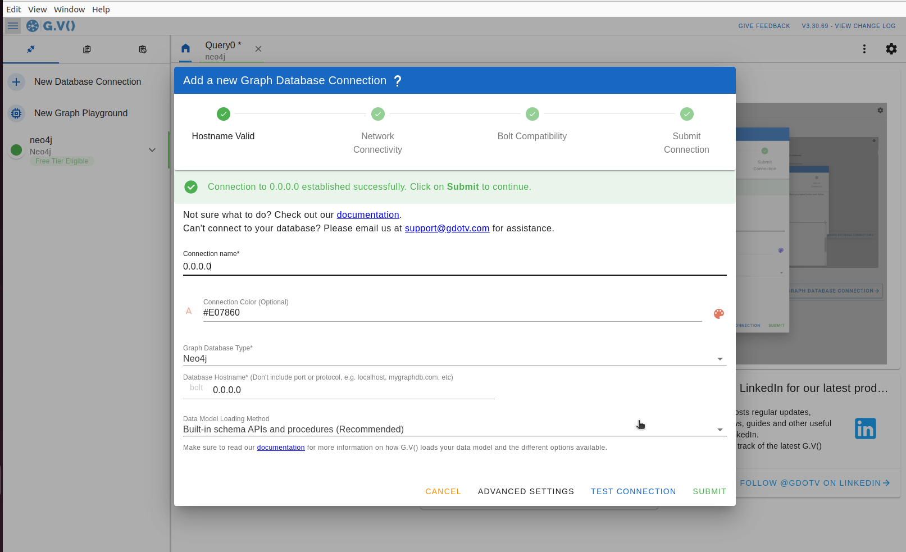
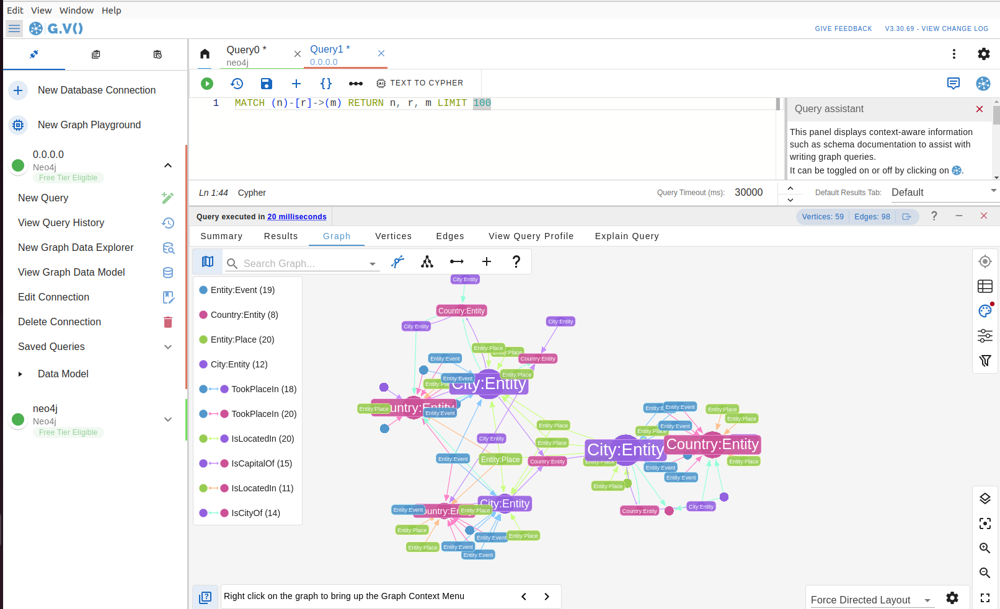
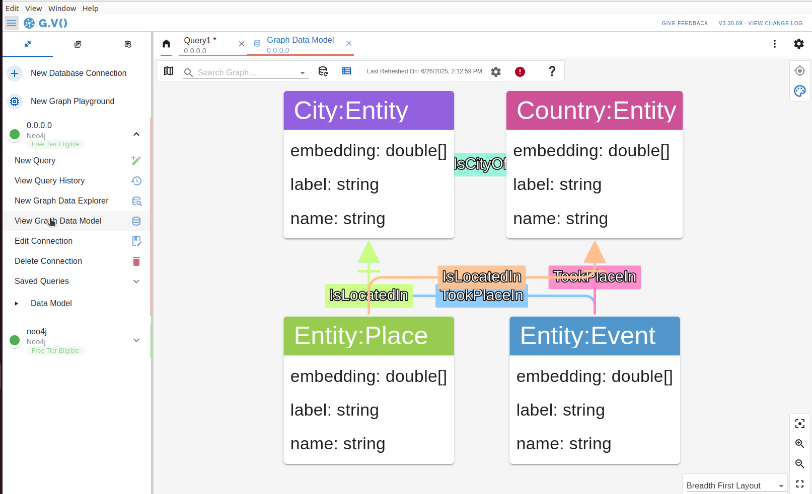

# Using G.V() as Graph IDE

**G.V()** is an all-in-one graph database IDE to write, debug, test and analyze results for your property-graph database. It offers a rich UI with smart autocomplete, graph visualization, editing and connection management.

This guide explains how to use [G.V()](https://gdotv.com/) to integrate with Synalinks to provide a rich set of visualization and analysis features for your graph data.

It is compatible with many graph databases so you can easily inspect Synalinks knowledge bases.

## Installation

This visualization tool is a desktop application that can be installed on Windows, macOS, and Linux. You can download the installer from their [homepage](https://gdotv.com/). It is also available for deployment as a web application on cloud platforms or self-service deployment via Docker. For more information on self-service deployments, please contact their support team.

## Connecting to your Knowledge Base

First, open the application and click on the "New Database Connection" button. You can select the knowledge base used like Neo4J from the list of supported databases. By default, the tool will try to connect to the Graph DB instance in read-write mode. If you want it to connect in read-only mode, you can select the "Read Only" option. Once selected, you can click on "Test Connection" to ensure the connection is successful.

The default visualization is a graph of the results. You can also choose to visualize the results as a table by returning the properties of the nodes or relationships.

In this example we are going to select Neo4J and connect to `0.0.0.0` because I run my Neo4J instance in a local Docker image.

## View Graph Schema

You can view the graph schema by clicking on the "View Graph Data Model" button in the left sidebar. This displays the graph schema in a convenient layout that shows the node labels, relationship labels, and their associated properties (and their data types). The graph schema will mirror the types that you declared with Synalinks data models.

## Licensing

This visualization tool is a *commercial product that requires a license key for long-term use*. You can get started with no commitment using their free trial or free tier version. To find out more, please visit their pricing page or contact their support team.