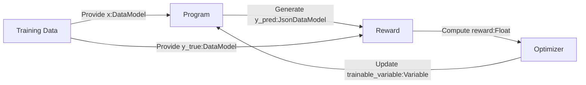

# Optimizers API

The `Optimizer`s are a key element in Synalinks, they updates the variables and backpropagate the rewards.

They are in charge of modifying and optimizing the variables (including the prompts) of each individual module composing a synalinks program.

This reinforcement loop is what makes possible for the system to learn by
repeatedly making predictions and refining its knowledge/methodology in order 
to maximize the reward.

## Optimizers API overview

- [Base Optimizer class](Base Optimizer class.md)
- [RandomFewShot optimizer](RandomFewShot.md)
- [OPRO optimizer](OPRO.md)
- [FewShotOPRO optimizer](FewShotOPRO.md)