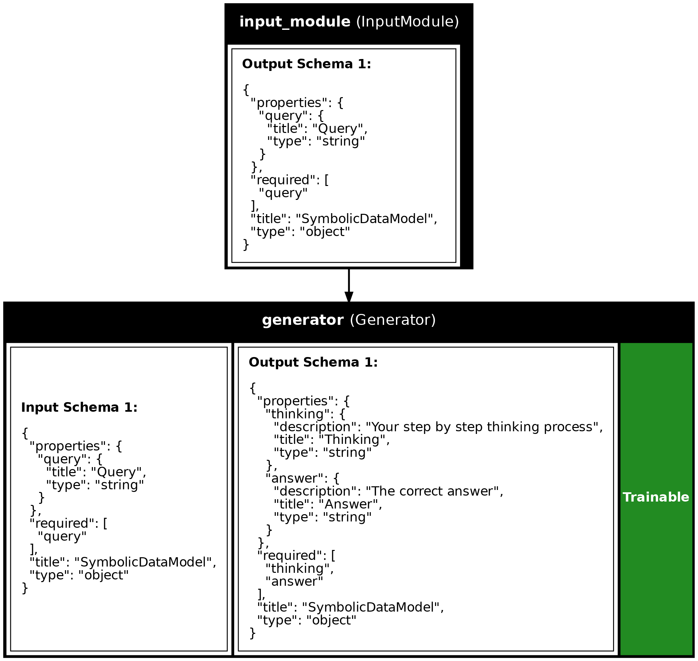

# Quickstart

## Install

```shell
uv pip install synalinks
```

Start your project with

```shell
uv run synalinks init
```

## Programming your application: 4 ways

### Using the `Functional` API

You start from `Input`, you chain modules calls to specify the program's structure, 
and finally, you create your program from inputs and outputs:

```python
import synalinks
import asyncio

async def main():
    class Query(synalinks.DataModel):
        query: str = synalinks.Field(
            description="The user query",
        )

    class AnswerWithThinking(synalinks.DataModel):
        thinking: str = synalinks.Field(
            description="Your step by step thinking process",
        )
        answer: float = synalinks.Field(
            description="The correct numerical answer",
        )

    language_model = synalinks.LanguageModel(
        model="ollama/mistral",
    )

    x0 = synalinks.Input(data_model=Query)
    x1 = await synalinks.Generator(
        data_model=AnswerWithThinking,
        language_model=language_model,
    )(x0)

    program = synalinks.Program(
        inputs=x0,
        outputs=x1,
        name="chain_of_thought",
        description="Useful to answer in a step by step manner.",
    )

if __name__ == "__main__":
    asyncio.run(main())
```

### Subclassing the `Program` class

In that case, you should define your modules in `__init__()` and implement the program's structure in `call()`.

**Note:** you can optionaly have a `training` argument (boolean), which you can use to specify a different behavior in training and inference.

```python
import synalinks
import asyncio

async def main():
    class Query(synalinks.DataModel):
        query: str = synalinks.Field(
            description="The user query",
        )

    class AnswerWithThinking(synalinks.DataModel):
        thinking: str = synalinks.Field(
            description="Your step by step thinking process",
        )
        answer: float = synalinks.Field(
            description="The correct numerical answer",
        )

    class ChainOfThought(synalinks.Program):
        """Useful to answer in a step by step manner.
        
        The first line of the docstring is provided as description
        for the program if not provided in the `super().__init__()`.
        In a similar way the name is automatically infered based on
        the class name if not provided.
        """

        def __init__(
            self,
            language_model=None,
            name=None,
            description=None,
            trainable=True,
        ):
            super().__init__(
                name=name,
                description=description,
                trainable=trainable,
            )
            self.answer = synalinks.Generator(
                data_model=AnswerWithThinking,
                language_model=language_model,
                name=self.name+"_generator",
            )

        async def call(self, inputs, training=False):
            if not inputs:
                return None
            x = await self.answer(inputs, training=training)
            return x

        def get_config(self):
            config = {
                "name": self.name,
                "description": self.description,
                "trainable": self.trainable,
            }
            language_model_config = \
            {
                "language_model": synalinks.saving.serialize_synalinks_object(
                    self.language_model
                )
            }
            return {**config, **language_model_config}

        @classmethod
        def from_config(cls, config):
            language_model = synalinks.saving.deserialize_synalinks_object(
                config.pop("language_model")
            )
            return cls(language_model=language_model, **config)

    language_model = synalinks.LanguageModel(model="ollama/mistral")

    program = ChainOfThought(language_model=language_model)

if __name__ == "__main__":
    asyncio.run(main())
```

### Mixing the subclassing and the `Functional` API

This way of programming is recommended to encapsulate your application while providing an easy to use setup.
It is the recommended way for most users as it avoid making your program/agents from scratch.
In that case, you should implement only the `__init__()` and `build()` methods.

```python
import synalinks
import asyncio

async def main():

    class Query(synalinks.DataModel):
        query: str = synalinks.Field(
            description="The user query",
        )

    class AnswerWithThinking(synalinks.DataModel):
        thinking: str = synalinks.Field(
            description="Your step by step thinking process",
        )
        answer: float = synalinks.Field(
            description="The correct numerical answer",
        )

    class ChainOfThought(synalinks.Program):
        """Useful to answer in a step by step manner."""

        def __init__(
            self,
            language_model=None,
            name=None,
            description=None,
            trainable=True,
        ):
            super().__init__(
                name=name,
                description=description,
                trainable=trainable,
            )

            self.language_model = language_model
        
        async def build(self, inputs):
            outputs = await synalinks.Generator(
                data_model=AnswerWithThinking,
                language_model=self.language_model,
            )(inputs)

            # Create your program using the functional API
            super().__init__(
                inputs=inputs,
                outputs=outputs,
                name=self.name,
                description=self.description,
                trainable=self.trainable,
            )

    language_model = synalinks.LanguageModel(
        model="ollama/mistral",
    )

    program = ChainOfThought(
        language_model=language_model,
    )

if __name__ == "__main__":
    asyncio.run(main())
```

This allows you to not have to implement the `call()` and serialization methods
(`get_config()` and `from_config()`). The program will be built for any inputs the first time called.

### Using the `Sequential` API

In addition, `Sequential` is a special case of program where the program
is purely a stack of single-input, single-output modules.

```python
import synalinks
import asyncio

async def main():
    class Query(synalinks.DataModel):
        query: str = synalinks.Field(
            description="The user query",
        )

    class AnswerWithThinking(synalinks.DataModel):
        thinking: str = synalinks.Field(
            description="Your step by step thinking process",
        )
        answer: float = synalinks.Field(
            description="The correct numerical answer",
        )

    language_model = synalinks.LanguageModel(
        model="ollama/mistral",
    )

    program = synalinks.Sequential(
        [
            synalinks.Input(
                data_model=Query,
            ),
            synalinks.Generator(
                data_model=AnswerWithThinking,
                language_model=language_model,
            ),
        ],
        name="chain_of_thought",
        description="Useful to answer in a step by step manner.",
    )

if __name__ == "__main__":
    asyncio.run(main())
```

## Getting a summary of your program

To print a tabular summary of your program:

```python
program.summary()
```

Or a plot (Useful to document your system):

```python
synalinks.utils.plot_program(
    program,
    show_module_names=True,
    show_trainable=True,
    show_schemas=True,
)
```



## Running your program

To run your program use the following:

```python
result = await program(
    Query(query="What is the French city of aerospace?"),
)
```

## Training your program

```python
async def main():

    # ... your program definition

    (x_train, y_train), (x_test, y_test) = synalinks.datasets.gsm8k.load_data()

    program.compile(
        reward=synalinks.rewards.ExactMatch(in_mask=["answer"]),
        optimizer=synalinks.optimizers.RandomFewShot()
    )

    batch_size=32
    epochs=10

    history = await program.fit(
        x_train,
        y_train,
        validation_data=(x_test, y_test),
        batch_size=batch_size,
        epochs=epochs,
    )

    synalinks.utils.plot_history(history)

if __name__ == "__main__":
    asyncio.run(main())
```